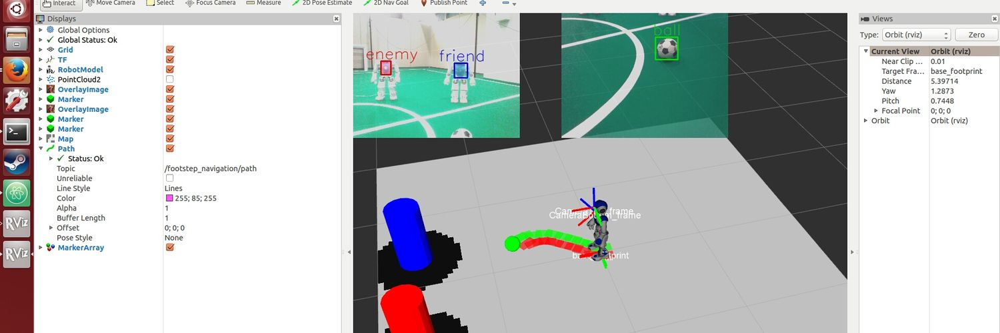

## Masaya Kataoka

## Who am I

### My work
:robot: I am currently working at [TierIV.inc](https://tier4.jp/) as an simulation/robotics engineer.  

### My hobby
:robot: I am also a member of [OUXT Polaris](https://www.ouxt.jp/) and building unmanned autonomous vessels.  
　
- Building lidar/camear fusion 3D perceprion system in ROS2
- Build camera-based 3D perception system in ROS1.
- Build 3D simulation environment from scratch.
- Build particle-filter based localization system.
- Build path/velocity plannig ROS2 package in ROS2.
- Build and maintain CI/CD pipeline for thie project.

:robot: I was an ex-team leader of [Joitech-SPL](http://www.er.ams.eng.osaka-u.ac.jp/asadalab/?p=893)  
　　
- Build camera-based 3D perception system in ROS1.
